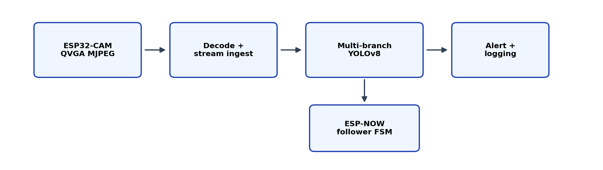

# PROJECT STRIX

[](LICENSE)

Resource-constrained **edge-AI research prototype** for aerial safety monitoring: ESP32-CAM MJPEG streaming, near-edge Python inference with composable YOLOv8 branches, structured alerts, and ESP-NOW-gated follower control on ESP-Drone firmware.

> **Scope:** Academic / controlled evaluation only — not a production security product.

## Architecture



| Stage | Component |
| --- | --- |
| Sense | ESP32-CAM @ QVGA MJPEG over HTTP `/stream` |
| Ingest | Python decode + stream reconnect (`droneai/`) |
| Infer | Multi-branch YOLOv8 workflow (`weapon_detector.py`) |
| Act | Cooldown-gated alerts + optional local LLM summary |
| Follow | ESP-NOW follower FSM (`ESP-Drone/`) |

Regenerate the diagram:

```bash
python droneai/experiments/generate_isaia_arch_figure.py
```

## Repository layout

| Path | Description |
| --- | --- |
| [`droneai/`](droneai/) | Python runtime, training, evaluation |
| [`ESP-Drone/`](ESP-Drone/) | ESP32-CAM stream + follower / leader firmware |
| [`docs/`](docs/) | Architecture asset, reproducibility, training notes, demo images |
| [`LICENSE`](LICENSE) | MIT (project code); third-party licenses apply in subfolders |

## Quick start

### 1. Python inference (near-edge)

```bash
cd droneai
python -m venv .venv
# Windows: .venv\Scripts\activate
# Linux/macOS: source .venv/bin/activate
pip install -r requirements.txt
```

Place fine-tuned weights as `droneai/weapon_detection_custom.pt` (not stored in this repo).

Run the runtime (after configuring stream URL in `config.yaml`):

```bash
python app.py
```

### 2. Evaluation / paper benchmarks

Set the dataset root (public [guns/knives YOLO](https://www.kaggle.com/datasets) layout — download separately):

```powershell
# PowerShell
$env:STRIX_DATASET_ROOT="C:\path\to\guns-knives-yolo\guns-knives-yolo"
```

```bash
cd droneai
python experiments/run_full_labs.py --max-images 0 --latency-repeats 3
python experiments/run_robustness_and_stats.py --bootstrap 400
python experiments/run_final_push.py --e2e-frames 40
```

Full steps: [`docs/REPRODUCIBILITY.md`](docs/REPRODUCIBILITY.md).

### 3. Embedded firmware

See [`ESP-Drone/README.md`](ESP-Drone/README.md) and [`ESP-Drone/core/Firmware/esp-drone/QUICKSTART.md`](ESP-Drone/core/Firmware/esp-drone/QUICKSTART.md).

## Dataset and training

- **Classes:** `knife`, `pistol` (2-class YOLO)
- **Splits (reference run):** 4409 train / 1043 val / 385 test images
- **Training script:** `droneai/weapon_training/train_weapon_model.py`
- **Config summary:** [`droneai/weapon_training/dataset_summary.md`](droneai/weapon_training/dataset_summary.md)
- **Details:** [`docs/TRAINING.md`](docs/TRAINING.md)

Raw images, labels, and `.pt` weights are **not** committed (size + licensing). Training metrics under `weapon_training/results/` stay local.

## Demo media

Example outputs (from the reference evaluation run):

| Asset | Description |
| --- | --- |
| [Detection batch](docs/demo/detection_example.jpg) | YOLO val visualization |
| [Latency ablation](docs/demo/ablation_latency.png) | Branch vs. mean latency |
| [PR trade-off](docs/demo/ablation_pr_scatter.png) | Precision–recall across configurations |

Optional screen recording: add `docs/demo/demo.mp4` (stream + alert UI) — see [`docs/demo/README.md`](docs/demo/README.md).

## Reproducibility

| Document | Contents |
| --- | --- |
| [`docs/REPRODUCIBILITY.md`](docs/REPRODUCIBILITY.md) | Environment, dataset path, script order, expected artifacts |
| [`droneai/experiments/README.md`](droneai/experiments/README.md) | Per-script CLI reference |

**Hardware note:** Benchmarks support an offline MJPEG surrogate when no ESP32-CAM is connected (`run_final_push.py`).

## Requirements

- **Python** 3.10+ — `droneai/requirements.txt`
- **ESP-IDF** — firmware builds under `ESP-Drone/` (see Espressif docs)
- **Optional:** [Ollama](https://ollama.com/) for local LLM alert narration

## Citation

If you use this codebase in academic work, please cite the associated PROJECT STRIX manuscript (IEEE ISAIA 2026 submission) and link this repository.

## Contact

**Daiwikdharsh S** — daiwikshinoy@gmail.com

## License

MIT License — see [LICENSE](LICENSE). Firmware and dependencies may include additional upstream terms (ESP-IDF, Ultralytics, Crazyflie/ESP-Drone lineage).
